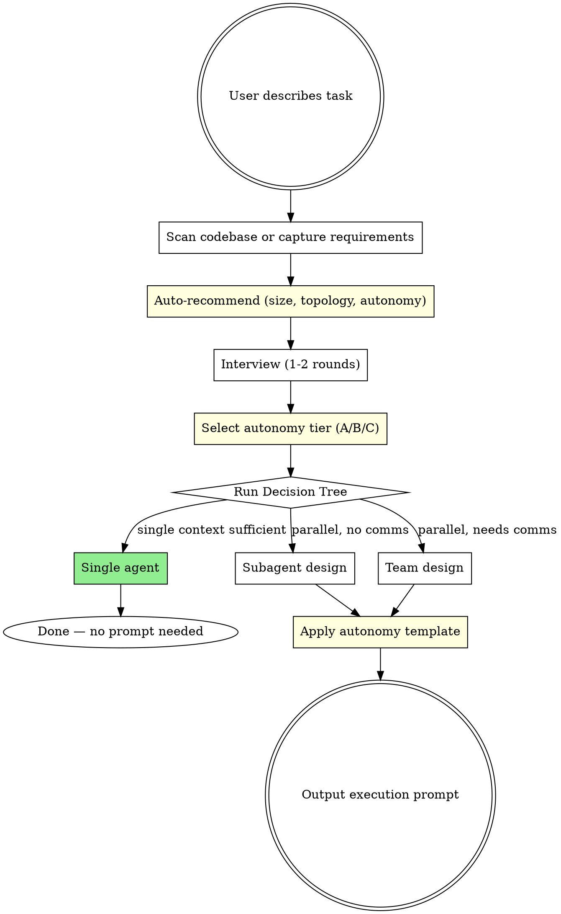

# Agent Team

Assess whether a task needs single agent, subagents, or a full agent team — then design and output a copy-paste execution prompt.

**Core principle: Always try the simplest approach first. Agent teams are expensive — justify the cost.**

## CRITICAL: AskUserQuestion Turn Separation

**AskUserQuestion은 이 스킬이 로드된 턴에서 절대 호출하지 마세요.**

**필수 절차:**
1. Phase 1 (Capture + Scan)을 수행한다
2. 분석 결과 + 자동 추천을 **텍스트로 출력**한다
3. **반드시 STOP하고 사용자 응답을 기다린다**
4. 사용자가 응답한 **다음 턴**에서 AskUserQuestion으로 Phase 2를 시작한다

## Process Flow



## Phase 1: Capture + Scan + Auto-Recommend

### 1a. Codebase Scan (if project exists)

- Read CLAUDE.md, specs/, plans/ if they exist
- Glob project structure (file count, directories)
- Identify tech stack, module boundaries, shared interfaces
- Flag mismatches between user's description and actual stack

**Auto-recommendation from scan:**

| Signal | Recommendation |
|---|---|
| Top-level dirs with 3+ files each | 1 agent per dir (max 5) |
| Shared interface files (types, contracts) | Pre-write in Phase 0 |
| Existing CLAUDE.md with ownership rules | Reuse ownership map |
| Single dir, ≤5 files | Single agent — END |

### 1b. Requirements Capture (if NO codebase — greenfield)

When there is nothing to scan, derive recommendations from requirements:

- Named modules/domains from user's request
- Tech stack preference (ask in Phase 2 if unknown)
- Estimated complexity per module

**Greenfield recommendation:**

| Signal | Recommendation |
|---|---|
| 1-2 named modules | Single agent or 2 subagents |
| 3+ named modules, independent | 1 agent per module |
| Modules share DB/auth/API | Pre-write contracts in Phase 0 |
| Tech stack unknown | Ask in Phase 2 Round 1 FIRST |

### 1c. Auto-Recommend Summary

Output a **preliminary** recommendation table. This is a hypothesis — Phase 3 Decision Tree is the final judge.

```
추천 결과 (예비 — Phase 3에서 확정):
- 접근법: [단독 / 서브에이전트 / 팀]
- 인원: [N명]
- 토폴로지: [패턴 이름]
- 파일소유권: [dir → agent 매핑]
- 자율성: [Tier A/B/C 추천 + 근거]
```

**Phase 1 추천 ≠ 최종 결정.** Phase 2 인터뷰 결과로 추천이 바뀔 수 있음. Phase 3 Decision Tree가 공식 판단.

### 1d. Stack Mismatch Handling

If scan reveals mismatch between user's description and actual stack:

1. **즉시 플래그** — Phase 1 출력에 `[주의] 스택 불일치` 경고 포함
2. **Phase 2 Round 1에 확인 질문 추가** — "요청하신 X와 실제 Y가 다릅니다. 교체/유지 중 어느 쪽인가요?"
3. **존재하지 않는 도메인** — 사용자가 요청한 작업 영역이 코드베이스에 없는 경우 (e.g., DB 없는 프로젝트에서 "DB 마이그레이션"), greenfield 1b 규칙을 해당 도메인에만 적용

Then **STOP and wait for user response**.

## Phase 2: Assess (Interview)

Use AskUserQuestion. 1-2 rounds, 2-3 questions per round.

**Round 1 — Scope & Autonomy:**
- How many distinct work areas? (모듈, 도메인, 파일 그룹)
- Are there sequential dependencies between them?
- 자율성 수준: 아래 3가지 중 어떤 방식을 원하시나요?

**Autonomy Tier Selection (MANDATORY — present to user):**

| Tier | Name | Leader Role | Agent Behavior | Best For |
|---|---|---|---|---|
| A | Prescribed | Task list + step-by-step | Follow exact instructions | 예측 가능한 결과, 첫 사용 |
| B | Semi-autonomous | Goals + constraints + file ownership | Plan own approach within boundaries | **업계 권장 (sweet spot)** |
| C | Fully autonomous | High-level objective only | Self-decompose, self-assign, self-review | 실험적, 고위험 |

**Default to Tier B** unless user explicitly requests otherwise.

**Round 2 (if ambiguous) — Coordination needs:**
- Do work areas share interfaces/contracts?
- Would agents need to negotiate decisions mid-task?
- Is there existing spec/plan to follow?

**Greenfield-specific questions (add to Round 1 if no codebase):**
- What tech stack? (framework, language, DB)
- Do you have a design/spec, or should agents create one?

## Phase 3: Judge (Decision Tree)

**Run this tree strictly. Do NOT skip to team design because a task "seems big".**

```
Q1. Can a single agent handle this in one context window?
    Indicators: ≤5 files, single domain, sequential steps
  ├─ YES → SINGLE AGENT. Tell user "팀 불필요" and END.
  └─ NO ↓

Q2. Are there 3+ independent parallel work units?
    Indicators: separate file groups, no shared mutable state
  ├─ NO → SINGLE AGENT with sequential subagent calls.
  └─ YES ↓

Q3. Do parallel agents need real-time communication?
    Indicators: shared contracts to negotiate, interface dependencies,
    need to react to each other's outputs mid-task
  ├─ NO → SUBAGENTS (Agent tool, parallel). Design in Phase 4a.
  └─ YES → AGENT TEAM (TeamCreate). Design in Phase 4b.
```

**"팀" ≠ TeamCreate:** User saying "팀으로 해줘" does NOT mean TeamCreate is needed. Always run Q1-Q3. Explain the distinction if decision tree says subagents but user said "팀".

**Cost check (MANDATORY before any multi-agent recommendation):**

| Approach | Relative Cost | When Worth It |
|---|---|---|
| Single agent | 1x | Default. Always try first |
| Subagents (parallel) | ~Nx | Time savings > cost increase |
| Agent Team | ~Nx + 30% comms overhead | Complex coordination essential |

**Real-world cost context:** Multi-agent setups consume ~15x tokens vs single agent. Present this to user. Get confirmation before designing.

## Phase 4a: Subagent Design

1. **Decompose** tasks into independent units (one per subagent)
2. **Assign file ownership** — NO overlap between subagents
3. **Define contracts** — shared interfaces written to files in Phase 0
4. **Set phases** — which subagents can run in parallel, which must wait

**Team size: 3-5 MAX.** More = decomposition is wrong. Group related work.

## Phase 4b: Agent Team Design

1. **Roles by tool/perspective difference**, not seniority
2. **3-5 teammates MAX** — more = coordination explosion
3. **Exclusive file ownership** — two agents never edit the same file
4. **Sufficient context in spawn prompts** — teammates don't inherit leader's history
5. **Deterministic orchestration** — fixed phase gates, not autonomous routing
6. **Generator + Critic** pattern where applicable (highest ROI)

**Topology selection:**

| Pattern | When | Example |
|---|---|---|
| Sequential Pipeline | Fixed workflow stages | Research → Write → Edit |
| Parallel Specialists | Same task, different lenses | Security + Performance + Test review |
| Generator + Critic | Quality-critical output | Code → Review loop |
| Map-Reduce | Independent chunks | Module A + B + C in parallel |
| Competing Hypotheses | Debugging, decision-making | 3 agents test 3 theories |

## Phase 4c: Apply Autonomy Template

**Autonomy determines HOW spawn prompts are written.** Same team structure, different prompt style.

### Tier A — Prescribed

```
Per-agent prompt includes:
- Numbered step-by-step task list (1. Do X, 2. Do Y, 3. Verify Z)
- Exact file paths to create/edit
- Expected output format
- Completion signal: "DONE: [exact checklist item completed]"
- NO self-planning: agent follows instructions only

Leader behavior:
- Creates full task list before spawning
- Assigns every task explicitly
- Reviews every output before next phase
```

### Tier B — Semi-autonomous (RECOMMENDED)

```
Per-agent prompt includes:
- Goal statement + success criteria
- File ownership boundaries (EXCLUSIVE)
- Constraints: what NOT to do, what NOT to touch
- Reference: shared contracts file paths
- Freedom: agent decides approach within boundaries
- Completion signal: "DONE: [summary of what was accomplished]"
- Checkpoint: agent reports plan BEFORE executing (leader approves or redirects)

Leader behavior:
- Writes contracts + constraints in Phase 0
- Spawns agents with goals (not steps)
- Reviews agent plans at checkpoint
- Intervenes only on contract violations or blocked signals
```

### Tier C — Fully Autonomous (HIGH RISK)

```
Per-agent prompt includes:
- High-level objective only
- File ownership boundaries (still EXCLUSIVE — non-negotiable)
- Budget limit: "Complete within N tool calls" (prevents runaway)
- Self-review: agent must verify own output before signaling done
- Completion signal: "DONE: [summary + self-review results]"

Leader behavior:
- Minimal Phase 0 (dir structure + ownership only)
- Does NOT create task lists — agents self-decompose
- Reviews only final output, not intermediate steps
- MUST set budget limits to prevent cost explosion

Budget N guideline:
- Simple module (≤5 files): N = 50 tool calls
- Medium module (5-15 files): N = 100 tool calls
- Complex module (15+ files or greenfield): N = 150 tool calls
- If unsure, start with N = 80 and adjust after first agent completes

⚠️ RISK WARNINGS (present to user before confirming Tier C):
- Cost explosion: agents may spawn sub-agents or loop without bound
- Direction drift: without checkpoints, agents may solve wrong problem
- Quality variance: no intermediate review = higher failure rate
- Recovery cost: if output is wrong, entire agent's work is wasted
- Recommended only for: experienced users, low-stakes experiments
```

## Phase 5: Output

**Final deliverable = copy-paste execution prompt.**

The prompt MUST contain ALL of the following. Missing any = incomplete prompt.

1. **Objective** (1 sentence)
2. **Autonomy tier** declared at top (A/B/C) — this determines prompt style
3. **Phase 0 — Scaffolding**: directory creation, dependency installation, contract files, environment setup. **For greenfield: includes project init (e.g., create-next-app).**
4. **Role list** with:
   - Name, description
   - `subagent_type` (REQUIRED — e.g., `general-purpose`, `Explore`)
   - `model` hint if relevant (e.g., `haiku` for search, `sonnet` for implementation)
5. **File ownership per role** — explicit paths, no overlaps
6. **Per-agent instructions** — style depends on autonomy tier:
   - Tier A: step-by-step tasks
   - Tier B: goals + constraints + checkpoint
   - Tier C: objective + budget limit
   - ALL tiers: fully materialized, NO placeholders like "[same as Agent 1]"
7. **Contract passing** — shared interfaces written to files. Specify exact paths.
   - **Contract ownership**: Leader owns contract files. Agents import, NEVER modify.
   - If agent needs contract change: signal "BLOCKED: need contract update on [type]" → Leader updates → agent resumes.
8. **Signal protocol**:
   - Subagents: return result to leader (automatic)
   - Team: SendMessage to leader with "DONE: {summary}" format
9. **Phase gates** — what must complete before what starts
10. **Failure handling**:
    - Agent outputs "BLOCKED: [reason]" → leader resolves, then resumes agent
    - Agent outputs "FAILED: [error]" after 1 retry → leader takes over that task manually
    - For Tier C: budget exceeded → force stop, leader reviews partial output
11. **Completion criteria** — specific, testable conditions (e.g., `npm run build` passes, tests pass)

Format:

```
## 아래 프롬프트를 Claude Code에 붙여넣으세요

> [한국어 요약: 팀 구성, 토폴로지, 자율성 Tier, 예상 비용 수준]

```text
[English execution prompt here]
```
```

Also write the prompt to `plans/{task-slug}-team-prompt.md` for reuse.

## Claude Code Platform Constraints

Know these BEFORE designing:

| Constraint | Impact |
|---|---|
| Teammates: 20 tools (subagents: 25) | Teammates can't use some tools subagents can |
| VS Code: team messages unstable | **Use terminal CLI only for team mode** |
| No shared memory between agents | ALL context must be in spawn prompt or files |
| Agents can't see leader's conversation | Spawn prompts must be fully self-contained |
| Cost: ~15x tokens vs single agent | Always present cost comparison first |

## Red Flags — STOP and Reconsider

- Designing 6+ teammates → decomposition is wrong, re-group
- No clear file ownership boundaries → risk of overwrites
- All tasks are sequential → subagent chain, not team
- "Feels like it needs a team" without Q1-Q3 → re-run decision tree
- Skipping cost check → always present cost comparison first
- User says "팀" but Q3=NO → explain: subagents are better, "팀" ≠ TeamCreate
- Tier C without budget limits → cost explosion risk, add limits before proceeding

## Common Mistakes

| Mistake | Fix |
|---|---|
| Jump to team design without interview | Always scan + interview first |
| 6+ agents because task is "big" | 3-5 max. Group related work |
| No file ownership plan | Every agent gets exclusive file list |
| Spawn prompt says "refactor the auth" | Include full context: stack, structure, interfaces |
| Skip cost comparison | Always show single vs sub vs team cost before designing |
| Design team for sequential workflow | Use subagent chaining instead |
| Missing `subagent_type` in spawn instructions | REQUIRED field — Agent tool will fail without it |
| Placeholder instructions "[same as Agent 1]" | Every agent gets fully materialized instructions |
| No Phase 0 scaffolding | Always create dirs, install deps, write contracts BEFORE spawning |
| No failure handling | Specify: BLOCKED/FAILED protocol per agent |
| Greenfield with no Phase 0 project init | Phase 0 MUST include project scaffolding (create-next-app, etc.) |
| Same prompt style for all autonomy tiers | Tier A=steps, Tier B=goals+constraints, Tier C=objective+budget |
| Tier C without budget limits | ALWAYS set tool-call budget for Tier C agents |
| Ignoring user's autonomy preference | Present A/B/C table, let user choose (default B) |

## Technical Constraint

Skills cannot use TeamCreate, SendMessage, or Agent tools directly. This skill **designs** the team and outputs a prompt that the user pastes into Claude Code to execute.
