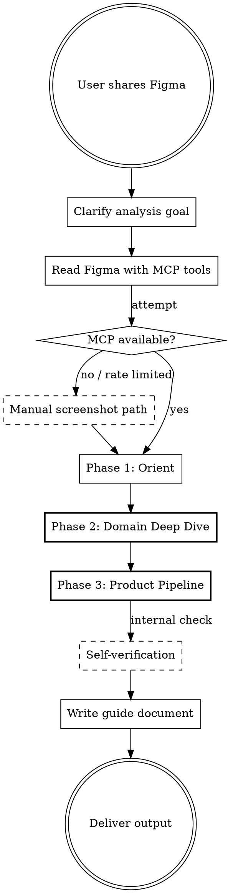

# Figma Analyzer

**Core principle: Understand the PRODUCT and DOMAIN, not the UI. The design is a window into the product — look through it, not at it.**

## When to Use

- Figma URL이나 디자인 스크린샷을 공유받고 제품/도메인을 이해해야 할 때
- 새 프로젝트에 합류하여 도메인 학습이 필요할 때
- 디자인에서 요구사항이나 플로우를 추출해야 할 때

**When NOT to use:** UI 스펙(픽셀, 컴포넌트명, 레이아웃) 작성 — 이 스킬은 제품/도메인 이해 전용

## Process Flow

## Quick Reference

| Phase | 목적 | 핵심 산출물 |
|-------|------|-----------|
| Phase 0 | 분석 목표 명확화 | 유저 역할, 필요 depth, 포커스 영역 |
| Phase 1 | 파일 구조 파악 (Orient) | 구조 테이블 + 도메인 식별 검증 |
| Phase 2 | 도메인 심층 분석 (THE CORE) | 워크플로우, 용어집, 핵심 개념 교육, 엔티티 관계 |
| Phase 3 | 제품 사용 흐름 | 제품 개요, 파이프라인, Step별 상세 |

| Scaling | Phases | Example |
|---------|--------|---------|
| Quick | Phase 0 → 1 → 2(인라인) + 3(요약) | "이 화면 하나만 봐줘" |
| Standard | Phase 0 → 1 → 2 → 3 → 검증 → 문서 | "이 피그마 분석해줘" |
| Deep | All + follow-up questions + 깊은 교육 | "전체 가이드 정리해줘" |

## Confidence Marking

모든 인사이트에 신뢰도 표시 필수:
- **[확인]** — 스크린샷/메타데이터에서 직접 관찰. 사실.
- **[추론]** — UI 패턴에서 논리적 도출. 높은 확신이나 직접 보이지는 않음.
- **[추정]** — 도메인 지식/업계 관행 기반 가설. 디자이너/PM 확인 필요.

## Phase 0: Clarify Analysis Goal

AskUserQuestion (1 round):
- 역할? (신규 팀원 / PM / 개발자 / 디자이너)
- 필요? (도메인 학습 / 제품 이해 / 기능 요구사항 / 전체)
- 깊이? (빠른 개요 / 상세 스펙 / 전체 문서화)

**"그냥 분석해줘"** → full analysis 가정. 단, 맥락 질문 1-2개는 여전히 필요.
**"기술 분석만 해줘"** → 정확한 결과는 제품 맥락에 의존함을 설명 + 압축된 제품 패스(~20% depth).

## Figma 데이터 수집

MCP 도구 우선순위: `get_screenshot` > `get_metadata` > `get_design_context` > `get_variable_defs`

MCP 사용 불가/rate limit 도달 시 **즉시 수동 스크린샷 경로로 전환 안내.** Read tool로 PNG/JPG 분석 가능.

**상세 가이드:** references/figma-data-collection.md 참조.

## Phase 1: Orient (File Structure Survey)

파일 구조를 읽고 mental map 구축. **순수 관찰** — 해석하지 않음.

**산출물:** 구조 테이블 (Page | Frames | Role)

**프레임 타입 구분:** UI 화면 vs 참조 프레임 vs 컴포넌트 라이브러리

### 도메인 식별 검증 (Phase 1→2 전환 체크포인트)

Phase 2 전에 "이 제품이 무엇인가"를 **명시적으로 확인.** 건너뛰면 도메인 오인식으로 전체 분석이 무효화.

필수 확인: 제품명/로고, 도메인 키워드, 불확실하면 유저에게 질문.

**CRITICAL:** 제품명/도메인 식별에 자신 없으면 **절대 추정으로 진행하지 말 것.** 유저에게 물어보기.

## Phase 2: Domain Deep Dive

**THE MOST IMPORTANT PHASE.** 도메인을 가르치는 것이 목표.

5개 Step: Domain Context → End-to-End Workflow → Glossary(3계층) → Core Concept Teaching(3~5개, 6요소) → Entities & State Machines

**핵심 규칙:**
- 관통 예시(Running Example) 하나로 모든 개념 설명
- 용어집은 MEANING으로 (단순 번역 금지)
- 핵심 개념은 6요소 필수: 한 줄 정의 / 비유 / 왜 중요 / 예시 / ASCII 다이어그램 / "이 제품에서"
- 도메인 워크플로우는 제품 기능이 아닌 **도메인 업무 프로세스**

**상세 가이드:** references/phase2-domain-deep-dive.md 참조.

## Phase 3: Product Pipeline

유저의 **업무 흐름**을 따라감 (화면 전환이 아님).

3개 Step: Product Big Picture → Pipeline Overview → Step-by-Step Detail

**핵심 규칙:**
- 각 Step은 도메인 워크플로우와 연결 (`> 도메인 워크플로우 [N]`)
- 항목 테이블은 도메인적 의미로 서술 (UI 스펙 X)

**상세 가이드:** references/phase3-product-pipeline.md 참조.

## Output Format

출력물은 `specs/{product-slug}-guide.md`에 작성. 4개 섹션: 제품 개요 / 도메인 핵심 개념 / 제품 사용 흐름 / 데이터 구조

**상세 가이드:** references/output-format.md 참조.

## Anti-patterns

| Anti-pattern | Symptom | Fix |
|---|---|---|
| Dev-spec 모드 전환 | Business Rules, User Stories 등 개발 스펙 포함 | 4개 섹션만 포함 (제품 개요/도메인/사용 흐름/데이터) |
| UI specification trap | "13컬럼, 32px Checkbox..." | WHAT과 WHY를 서술, 픽셀/컴포넌트 X |
| Shallow domain glossary | "코드셋 = 코드의 집합" | 비즈니스 맥락과 구체적 예시로 설명 |
| Screen-hopping flow | "Screen A → click → Screen B" | 유저의 업무 흐름으로 서술 |
| No MCP fallback | "MCP 없어서 분석 불가" | 즉시 수동 스크린샷 경로 안내 |
| Unmarked inferences | 사실과 추론 혼재 | [확인]/[추론]/[추정] 마커 필수 |
| 도메인 오인식 | 약어에서 잘못된 추정 | Phase 1→2 전환 시 검증 필수 |
| 추정 기반 폭주 | 읽을 수 없는데 추정으로 계속 | STOP & ASK |
