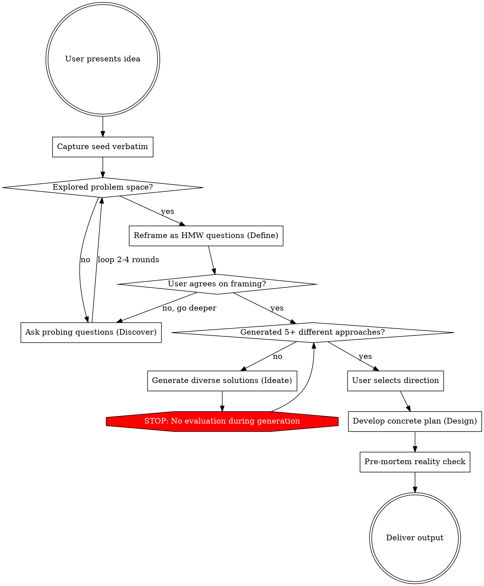

# Ideation

Turn vague ideas into concrete plans through structured divergent-then-convergent exploration.

**Core principle: Explore the problem BEFORE solving it. Generate many approaches BEFORE choosing one.**

## Process Flow



## Phase 0: Seed Capture

Capture the user's idea **verbatim**. Do NOT interpret, refine, or solve yet.

Note:
- What type? (architecture / feature / tech adoption / process / exploration)
- What excites them about it?
- What solution did they imply (if any)? — this is the anchor to challenge later

## Scaling the Process

Not every idea needs all 4 phases at full depth. Scale to complexity:

| Complexity | Phases | Example |
|---|---|---|
| Light | Phase 0 → Phase 1 (1 round) → Phase 3 → done | "로깅 라이브러리 뭐 쓸까?" |
| Medium | All phases, 2 rounds each | "캐시 시스템 도입하고 싶어" |
| Deep | All phases, 3-4 rounds each + written output | "마이크로서비스 전환 검토" |

**Minimum requirement:** Even for "Light" ideas, always do at least Phase 0 + 1 round of Phase 1 questions. Never skip straight to solutions.

**If the user says "질문 말고 그냥 아이디어 줘":** Acknowledge the request, explain briefly why 1 round of questions will make the ideas much better, then ask just 2 focused questions. If they insist again, proceed to Phase 3 but flag assumptions made without exploration.

## Phase 1: Discover (DIVERGENT — Expand Problem Space)

**RULE: NO solutions in this phase. Only questions.**

**Pacing: 2-3 questions per round, max.** Do NOT dump all questions at once — even under time pressure. Each round builds on previous answers.

Use AskUserQuestion (2-3 questions per round, 2-4 rounds):

| Question Type | Purpose | Example |
|---|---|---|
| Why | Uncover motivation | "What triggered this idea? What pain drives it?" |
| Who | Identify stakeholders | "Who benefits most? Who is affected negatively?" |
| What-if-not | Explore inaction | "What happens if we do nothing for 6 months?" |
| Constraint removal | Expand space | "If [X] didn't exist, what would you build?" |
| Constraint addition | Reveal priorities | "If you had to ship in 1 week, what's the core?" |
| Inversion | Surface risks | "How would this fail spectacularly?" |
| Scaling | Test boundaries | "What changes at 10x? At 100x?" |

**Anti-anchoring:** If the user names a specific solution (e.g., "마이크로서비스로 전환"), do NOT accept it as the answer. Explore the underlying problem first. The named solution is a hypothesis, not a conclusion.

**Completion criteria:** Move to Phase 2 when you understand:
- The real pain/opportunity (not just the surface request)
- Who cares and why
- Key constraints (real vs. assumed)
- What success looks like

## Phase 2: Define (CONVERGENT — Reframe the Problem)

Synthesize Phase 1 into **How Might We (HMW)** questions. Present 3-5 framings via AskUserQuestion.

Example: "서비스가 커지고 있어서 마이크로서비스로 전환하고 싶어" →
- HMW: "팀이 서로 블로킹 없이 독립적으로 배포하려면?"
- HMW: "코드베이스 복잡성을 관리하면서 10배 성장하려면?"
- HMW: "배포 안정성을 높이면서 속도도 빠르게 하려면?"
- HMW: "새 팀원이 1주일 안에 생산적이 되려면?"

Each HMW opens a **different solution space**. Get user agreement on which 1-2 framings capture the real opportunity.

## Phase 3: Ideate (DIVERGENT — Generate Solutions)

**RULES:**
1. Minimum **5 genuinely different** approaches — NOT variations of one idea
2. Each approach must have a **fundamentally different strategy** (different trade-offs, different assumptions)
3. Include at least **1 unconventional/surprising** approach
4. Use **cross-domain analogies** where helpful ("How does [unrelated field] solve this?")
5. **NO evaluation during this phase** — list ALL approaches neutrally

Present as a comparison table:

```markdown
| # | Approach | Core Idea | Key Trade-off |
|---|----------|-----------|---------------|
| 1 | ...      | ...       | ...           |
| 2 | ...      | ...       | ...           |
```

Then ask the user to select 1-2 approaches for deeper exploration via AskUserQuestion.

## Phase 4: Design (CONVERGENT — Concrete Plan)

For selected approach(es):

1. **Evaluate** — Quick assessment: Feasibility / Impact / Risk / Effort
2. **Scope v1** — What's IN? What's explicitly OUT?
3. **Key decisions** — 2-3 critical decisions with trade-offs (ADR style: Options → Decision → Rationale)
4. **Pre-mortem** — "It's 6 months later, this failed. Why?" Surface 3+ failure modes
5. **Next steps** — Concrete action items

## Output Format

Adapt to the depth of exploration:

| Depth | When | Output |
|---|---|---|
| Quick | User wants ideas, not a plan | Conversation: idea list + insights |
| Medium | Comparison needed | Comparison table + recommended direction with rationale |
| Deep | Architecture/major decision | Written document: `plans/{topic-slug}.md` with ADR structure |

For written documents, include: Context, Decision Drivers, Options Considered (with pros/cons), Recommendation, Consequences, Next Steps.

## Anti-patterns — What This Skill Prevents

| Anti-pattern | Symptom | Fix |
|---|---|---|
| Premature convergence | Jumping to solutions in Phase 1 | Enforce phase separation. NO solutions until Phase 3 |
| Anchoring | Accepting user's implied solution as given | Treat named solutions as hypotheses. Explore the problem first |
| Shallow diversity | 5 variations of the same idea | Each approach needs different fundamental trade-offs |
| Evaluation during ideation | "This won't work because..." in Phase 3 | Save ALL evaluation for Phase 4 |
| Questions last | Giving advice, then asking "what's your situation?" | ALWAYS explore first (Phase 1-2), suggest later (Phase 3-4) |
| Agreement bias | "Great idea! Here's how..." | Ask "What if the opposite were true?" in Phase 1 |
| Question dump | 15+ questions in one round under time pressure | Strict 2-3 per round. Depth over breadth per round |
| Skipping Phase 2 | Jumping from questions straight to solutions | HMW reframing ensures you're solving the RIGHT problem |
