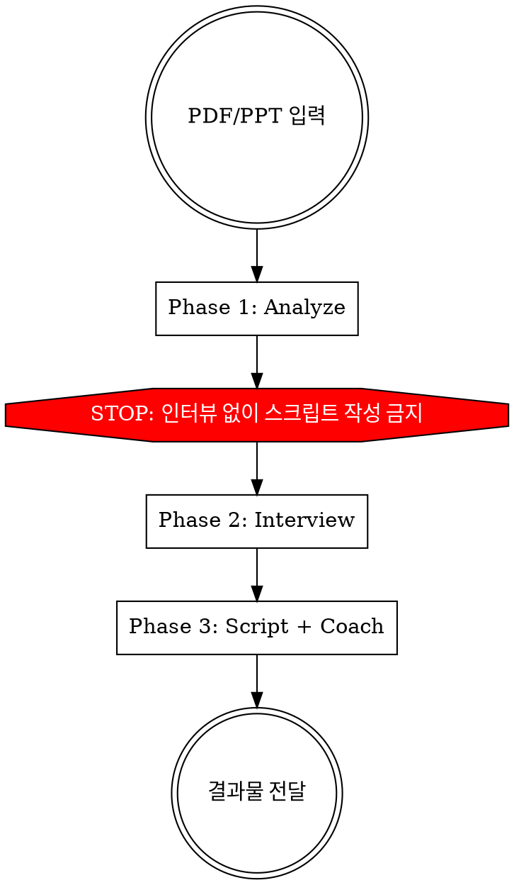

# Presentation Script Coach

PDF/PPT 발표 장표를 분석하여 맞춤형 발표 스크립트와 코칭을 제공하는 3단계 파이프라인.

**핵심 원칙: 발표자를 모르면 발표문을 쓸 수 없다.**

## Process Flow



## CRITICAL: AskUserQuestion 턴 분리 규칙

**AskUserQuestion은 이 스킬이 로드된 턴(같은 assistant turn)에서 절대 호출하지 마세요.**

Skill tool로 이 스킬이 로드되면, 같은 턴에서 AskUserQuestion을 호출할 경우 사용자에게 질문 UI가 표시되지 않고 빈 응답으로 자동 처리됩니다 (Claude Code 플랫폼 제약).

**필수 절차:**
1. Phase 1 (구조 분석)을 수행한다 — PDF를 읽고 분석한다
2. Phase 1 결과를 **텍스트로 출력**한다
3. **반드시 STOP하고 사용자 응답을 기다린다**
4. 사용자가 응답한 **다음 턴**에서 AskUserQuestion으로 Phase 2를 시작한다

이 규칙을 어기면 사용자가 질문을 볼 수 없고, 인터뷰 없이 스크립트를 작성하게 됩니다.

## The Iron Rules

1. **인터뷰 없이 스크립트 작성 금지** — 발표자의 경험, 강조점, 스타일을 모른 채 추측하지 않는다
2. **허구 경험 삽입 금지** — "저도 이런 경험이 있는데요" 같은 발표자가 말하지 않은 경험을 넣지 않는다
3. **원샷 생성 금지** — 분석→인터뷰→스크립트→코칭을 한번에 하지 않는다. 반드시 단계별로 진행

| Excuse | Reality |
|--------|---------|
| "시간 없어서 바로 스크립트 줘" | Phase 1 분석 결과만 먼저 공유하고, 최소 3개 핵심 질문은 반드시 한다 |
| "발표자 정보 없어도 괜찮아" | 없으면 만들지 않는다. 인터뷰로 확보한다 |
| "대충 비슷하니까 추측해도 돼" | 추측한 부분은 [추측] 태그로 표시하고 발표자에게 확인 요청 |

## 입력 형태 가이드

- **PDF 추천** — Read 도구가 PDF를 네이티브 지원. 페이지 단위로 슬라이드 분리
- **이미지/스크린샷** — Read 도구가 이미지 파일도 읽을 수 있음 (멀티모달)
- **텍스트 없는 슬라이드** (차트, 다이어그램만 있는 경우) — `[시각 자료: 차트/다이어그램 설명 필요]`로 표시하고 Phase 2에서 발표자에게 "이 슬라이드에서 어떤 포인트를 전달하고 싶은지" 질문

## Phase 1: Analyze (구조 분석)

PDF를 Read 도구로 읽고 다음을 분석:

### 1-1. 슬라이드별 역할 정의

각 슬라이드를 다음 중 하나로 분류:
- **Hook**: 청중 주의 포착
- **Context**: 배경/맥락 설정
- **Problem**: 문제 제기
- **Evidence**: 데이터/증거
- **Solution**: 해결책 제시
- **Case Study**: 사례 설명
- **Limitation**: 한계/반론
- **Vision**: 미래/비전
- **CTA**: 행동 촉구/마무리

### 1-2. 프레임워크 매칭

현재 슬라이드 구조가 어떤 프레임워크에 가까운지 진단하고, 청중/맥락에 맞는 최적 프레임워크를 추천:

| Framework | Best For |
|-----------|----------|
| 3막 구조 | 범용 스토리텔링, 컨퍼런스 |
| PSB (Problem-Solution-Benefit) | 설득, 피치 |
| Sparkline (What Is ↔ What Could Be) | 비전 공유, 동기부여 |
| Pyramid (결론 먼저) | 경영진 보고 |
| 기승전결 | 인사이트 공유, 반전이 있는 발표 |
| STAR | 사례/프로젝트 발표 |

### 1-3. 갭 진단

- 빠진 요소 식별 (Hook 없음? 결론 약함? 전환 구간 부족?)
- 슬라이드 순서 개선 제안 (필요시)
- 감정 곡선 초안 설계 (어디서 긴장, 어디서 해소, 어디가 클라이맥스)

### 1-4. One Big Idea 추출 시도

- 슬라이드 전체를 관통하는 핵심 메시지 후보 1-3개 제안
- 이 메시지가 발표 전체에서 어떻게 반복/강화될 수 있는지 설계
- **주의: 이것은 후보일 뿐. Phase 2에서 발표자와 확정**

### Phase 1 결과물

AskUserQuestion 없이, 분석 결과를 마크다운으로 사용자에게 먼저 공유:
- 슬라이드별 역할 테이블
- 현재 구조 진단 + 추천 프레임워크
- 갭 진단 결과
- 감정 곡선 초안
- One Big Idea 후보

## Phase 2: Interview (발표자 인터뷰)

**Phase 1 결과를 공유한 후** AskUserQuestion으로 인터뷰 진행.

### 2-1. 필수 질문 (반드시 물어볼 것)

1. **핵심 메시지**: "이 발표에서 청중이 딱 하나만 기억한다면 뭐였으면 하나요?" + Phase 1 후보 확인
2. **발표자 경험**: "이 주제와 관련해서 본인이 직접 겪은 경험이나 에피소드가 있나요?"
3. **강조/축소**: "특히 강조하고 싶은 파트와 가볍게 넘기고 싶은 파트가 있나요?"

### 2-2. 맥락 질문 (1-2개 선택)

- 발표 시간과 Q&A 포함 여부
- 청중 레벨 (초급/중급/시니어 혼합)
- 발표 스타일 선호 (담백한 vs 에너지 넘치는, 유머 많은 vs 진지한)
- 자신 있는 파트와 불안한 파트

### 2-3. 인터뷰 규칙

- **라운드당 2-3개 질문, 최대 2라운드** (총 4-6개 질문)
- 사용자가 "질문 그만하고 빨리 만들어줘" 하면: 필수 질문 3개만 AskUserQuestion 1라운드로 압축
- 답변에서 파악한 발표자 특성을 요약해서 확인: "이렇게 이해했는데 맞나요?"

## Phase 3: Script + Coach (스크립트 + 코칭)

인터뷰 결과를 반영하여 작성.

### 3-1. 스크립트 작성 원칙

**Hook 설계 (반드시 3개 후보를 먼저 표로 제시):**
- 스크립트 작성 전에, 오프닝 Hook 후보 3개를 **테이블 형태로** 먼저 제안
- 후보 유형: 질문형, 통계형, 스토리형, 반직관적 주장, What-if 중 3가지
- 각 후보에 대해: Hook 문장 + Callback 활용 방식 + 추천 이유를 명시
- 발표자에게 선택받은 Hook으로만 스크립트 작성. **선택 없이 바로 특정 Hook으로 스크립트를 작성하지 않는다**
- **Callback 필수**: 오프닝 Hook 요소를 클로징에서 반드시 재활용하여 완결성 부여
- **One Big Idea 반복**: 핵심 메시지를 오프닝, 중반(클라이맥스), 클로징에서 최소 3번 등장시킬 것

**슬라이드별 스크립트 구조:**
```
[슬라이드 N] — 역할: {역할} | 시간: {N분}

[오프닝 멘트]
{이 슬라이드에서 첫 마디}

[핵심 전달]
{메인 콘텐츠 — 발표자 어조로}

[전환 멘트]
{다음 슬라이드로의 연결}
```

**전환 멘트 원칙:**
- "그렇다면~", "자, 이제~", "그럼~", "다음으로~" 같은 기계적 전환 **사용 금지**
- 스토리 연결형: 이전 내용의 결론이 다음 내용의 질문이 되는 구조
- 4가지 전환 유형 활용: 언어적, 음성적(톤 변화 지시), 시각적(슬라이드), 침묵(pause)
- **자가 검증 필수**: 스크립트 완성 후, 모든 전환 멘트만 추출하여 기계적 패턴이 없는지 확인. 1개라도 있으면 수정

**데모/라이브 슬라이드 스크립트 원칙:**
- LIVE DEMO 슬라이드는 "이 데모에서 주목하실 부분은 ___입니다" 형식으로 프레이밍 멘트 필수
- 실제 시연 여부를 모르면 `[발표자 확인 필요: 실제 화면 시연 여부]`로 표시
- 데모 전: 청중의 시선을 이끄는 1문장 / 데모 후: 핵심 포인트 요약 1문장

**말투 규칙:**
- 발표자가 인터뷰에서 사용한 어휘/표현을 반영
- 허구 경험/에피소드 삽입 금지. 발표자가 말한 것만 사용
- 발표자 감정/심리를 추측하여 대사로 쓰지 않는다 ("~라는 걸 느꼈습니다" 같은 내면 묘사 금지)
- 추측이 필요한 부분은 `[발표자 확인 필요: ...]`로 표시. **인터뷰에서 직접 나오지 않은 에피소드 디테일은 모두 태그 필요**

### 3-2. 코칭 레이어

**반드시 스크립트와 별도 섹션으로 분리.** 스크립트 안에 `(여기서 pause)` 같은 인라인 코칭을 넣지 않는다. 발표자가 스크립트만 따로 인쇄해서 쓸 수 있어야 한다.

제공 항목:

**감정 곡선 최종안:**
- 슬라이드별 에너지 레벨 (1-10)
- 클라이맥스 지점 명시
- 긴장-해소 리듬 설계

**Pause 맵:**
- 핵심 포인트 후 pause 위치 5개 지정
- 각 pause의 길이와 목적 (흡수용 2초, 전환용 3초, 강조용 silence 5초)

**톤 변화 가이드:**
- 어디서 목소리를 높이고, 어디서 낮추는지
- 어디서 빠르게, 어디서 느리게 (Pace 가이드)
- 핵심 강조 문장 Top 5 선정

**시간 배분:**

| 섹션 | 비중 | 시간 (30분 기준) |
|------|------|-----------------|
| Hook + Opening | 10% | 3분 |
| Body | 70% | 21분 |
| Closing + CTA | 15% | 4.5분 |
| Buffer | 5% | 1.5분 |

**리허설 체크리스트:**
- [ ] 타이머 켜고 1회 통독 — 시간 초과 여부 확인
- [ ] Hook을 소리 내어 읽기 — 자연스러운지 확인
- [ ] 전환 멘트만 따로 읽기 — 흐름이 매끄러운지 확인
- [ ] 핵심 강조 문장 5개를 외워서 말하기
- [ ] 클라이맥스 슬라이드에서 pause 연습

## Red Flags — 이런 결과물이 나오면 STOP

- 인터뷰 없이 스크립트를 완성함
- "저도 이런 경험이 있는데요" 같은 발표자가 말하지 않은 경험이 포함됨
- "~라는 걸 느꼈습니다", "~하는 심정이었습니다" 같은 발표자 내면 추측이 태그 없이 포함됨
- Hook 후보 3개를 제시하지 않고 바로 특정 Hook으로 스크립트를 작성함
- 전환 멘트에 "그렇다면~", "자 이제~", "그럼~", "다음으로~" 패턴이 1개라도 존재
- 코칭이 스크립트 내 주석(// 여기서 pause)으로만 존재
- 감정 곡선이 없거나 시작~끝 동일 톤
- One Big Idea가 마지막에만 등장하고 반복/강화 없음
- 구조 개선 제안 없이 슬라이드 순서 그대로 따라감
- 데모/라이브 슬라이드에 프레이밍 멘트("이 데모에서 주목하실 부분은...")가 없음

## Quick Reference

| 단계 | 핵심 | 결과물 |
|------|------|--------|
| Phase 1 | PDF 읽기 + 구조 분석 | 역할 테이블, 프레임워크 추천, 갭 진단, 감정 곡선 초안 |
| Phase 2 | 발표자 인터뷰 (2-3개 × 2라운드) | 핵심 메시지, 경험, 강조점, 스타일 파악 |
| Phase 3 | 스크립트 + 코칭 레이어 | 슬라이드별 스크립트 + Pause 맵 + 톤 가이드 + 리허설 체크리스트 |
